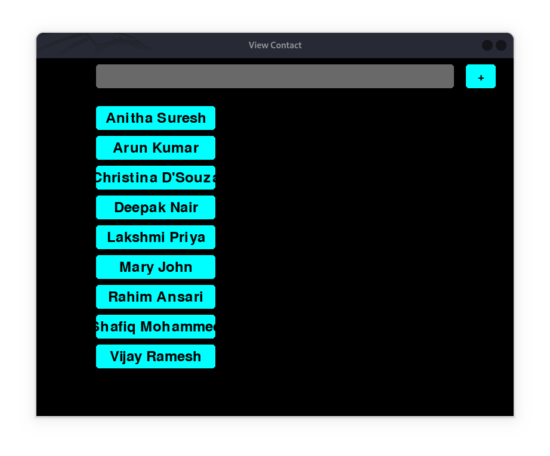
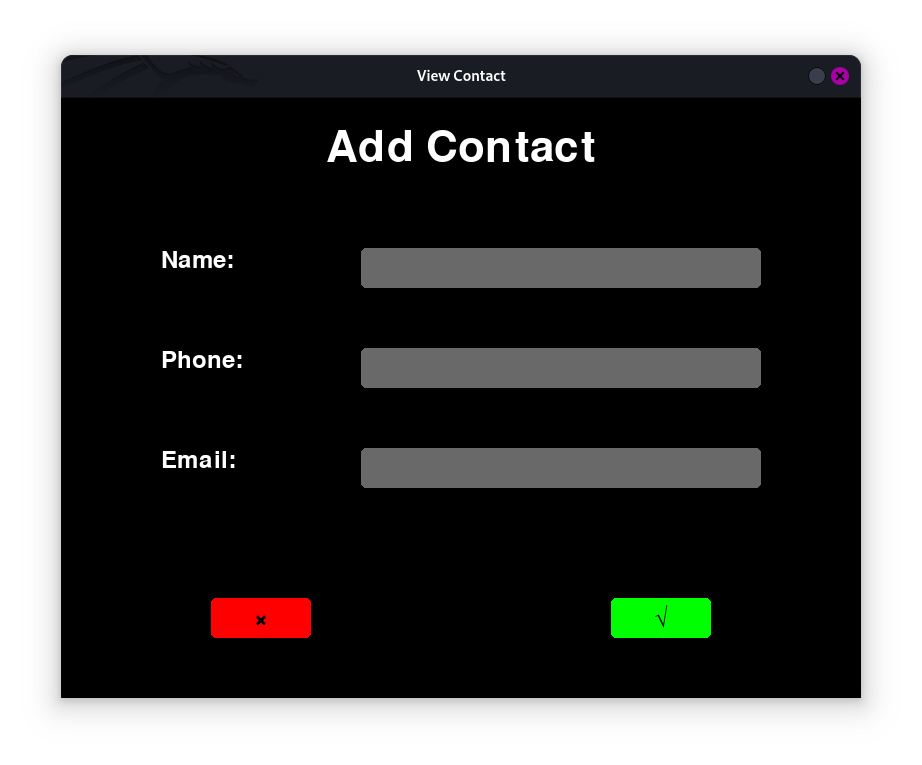
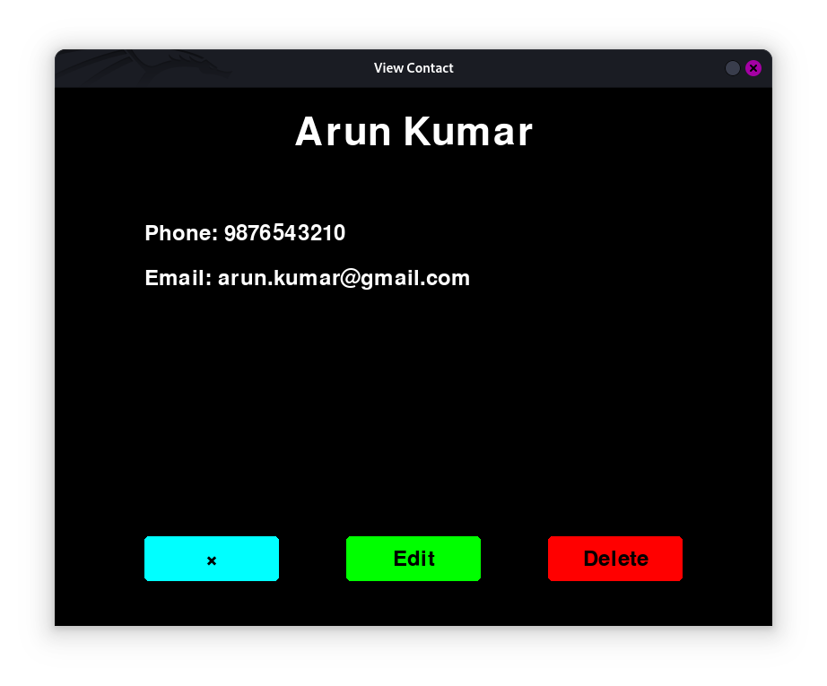

# PRODIGY_SD_03
Software Development Internship of InfoTech Prodigy

---

## **Simple Contact Management System**

A Python-based **Simple Contact Management System** built with Pygame. This project allows users to add, edit, view, and delete contacts seamlessly with an intuitive graphical interface. It manages contacts stored in a CSV format for simplicity and ease of use.

---

### 1. **Contact List**  
A list of all contacts with a search bar for filtering and a button to add new contacts.  



### 2. **Add/Edit Contact**  
Add a new contact or edit an existing one.  



### 3. **View Contact**  
Displays the details of a selected contact with options to edit or delete.  


---

### **Features**
1. **View Contacts**  
   - Displays all contacts in alphabetical order.
   - Includes a search bar to filter contacts in real time.
   - Clicking on a contact lets you view its details.
   - Contacts are clickable buttons for easy navigation.

2. **Add New Contacts**  
   - Add a new contact with fields for:
     - Name (required).
     - Phone number (optional).
     - Email (optional).
   - Cancel or save changes seamlessly.

3. **Edit Existing Contacts**  
   - Modify details of an existing contact.
   - Pre-fills data for easy editing.
   - Save updated information back to the contact list.

4. **Delete Contacts**  
   - Delete unwanted contacts with a confirmation popup.

5. **File Management**  
   - Contact data is stored in a file named `contact.txt` in CSV format.
   - Selected contact data is temporarily stored in `current.txt`.

---

### **How to Use**
1. **Start the Program**  
   Run `main.py` to launch the contact management system.

2. **Navigation**  
   - Start with the contact list.
   - Add, edit, or delete contacts as needed.
   - View contact details by clicking on a contact name.

3. **Transitions**  
   - Navigate seamlessly between screens (`list`, `add`, `view`) based on your actions.

---

## **Technical Details**

### **File Structure**
- `contact.txt`: Stores the list of contacts in CSV format (`sino,name,phone,email`).
- `current.txt`: Temporary file used for storing the serial number of the selected contact.

### **Modules**
- **list.py**: Displays the contact list and handles navigation to add or view contacts.
- **add.py**: Allows adding or editing contacts.
- **view.py**: Displays contact details and manages deletion or editing.
- **main.py**: Integrates all modules and manages transitions.

---

## **Requirements**
- Python 3.x
- Pygame library (`pip install pygame`)

---

## **Installation**
1. Clone this repository:  
   ```bash
   git clone https://github.com/shamiroxs/PRODIGY_SD_3.git
   ```
2. Navigate to the project directory:  
   ```bash
   cd PRODIGY_SD_3
   ```
3. Install the required dependencies:  
   ```bash
   pip install pygame
   ```
4. Run the main program:  
   ```bash
   python main.py
   ```

---

## **License**
This project is licensed under the MIT License. See the `LICENSE` file for details.

---

Feel free to contribute, provide feedback, or report issues!  

**Author**: [Shamiroxs](https://github.com/shamiroxs)
